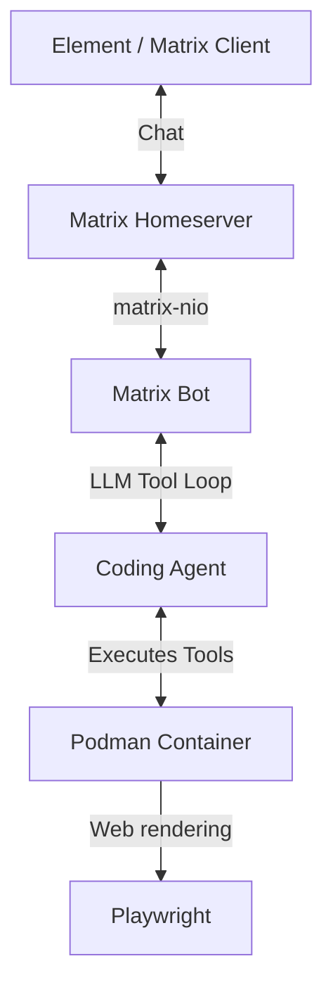

<h1 align="center">Matrix Agent TUI</h1>

<p align="center">
  <em>A self-hosted agentic coding assistant accessible via Matrix chat.</em>
</p>

<p align="center">
  
  
  
  
</p>

---

**Matrix Agent** brings an autonomous coding assistant directly into your Matrix chat rooms. Each room receives an isolated Podman container where the agent can write code, execute commands, and even take browser screenshots. It's like having a dedicated developer sitting in your chat room, ready to build!

## ✨ Features

- **Isolated Workspaces**: Every Matrix room gets its own dedicated Podman sandbox container.
- **Full Coding Environment**: Sandboxes come pre-loaded with Python 3, Node.js 20, Git, and Playwright.
- **Multi-LLM Support**: Powered by LiteLLM — use Claude, Gemini, MiniMax, or any OpenRouter model.
- **Visual Feedback**: The agent can take screenshots of web apps running in the sandbox and send them to the chat.
- **Ephemeral & Secure**: Containers are automatically destroyed when all users leave the room.

## 🏗️ Architecture



## 🚀 Quick Start

### Prerequisites

- **Python 3.12+**
- **[uv](https://github.com/astral-sh/uv)** package manager
- **Podman** installed and running
- A **Matrix account** for the bot (e.g., register at [Element](https://app.element.io/))
- An **LLM API key** (OpenRouter, Gemini, MiniMax, etc.)

### Setup

1. **Clone the repository:**
   ```bash
   git clone https://github.com/BoomMccloud/matrix-tui.git
   cd matrix-tui
   ```

2. **Build the sandbox container image:**
   ```bash
   podman build -t matrix-agent-sandbox -f Containerfile .
   ```

3. **Configure the environment:**
   ```bash
   cp .env.example .env
   # Edit .env with your credentials (see Configuration below)
   ```

4. **Run the bot:**
   ```bash
   uv run python -m matrix_agent
   ```

## ⚙️ Configuration

All configuration is managed via environment variables or the `.env` file.

| Variable | Required | Default | Description |
|----------|----------|---------|-------------|
| `MATRIX_HOMESERVER` | No | `https://matrix.org` | Matrix homeserver URL |
| `MATRIX_USER` | Yes | | Bot's Matrix user ID (e.g., `@mybot:matrix.org`) |
| `MATRIX_PASSWORD` | Yes | | Bot's Matrix password |
| `LLM_API_KEY` | Yes | | API key for your LLM provider |
| `LLM_MODEL` | No | `openrouter/anthropic/claude-sonnet-4` | LiteLLM model string |
| `PODMAN_PATH` | No | `podman` | Path to the podman binary |
| `SANDBOX_IMAGE` | No | `matrix-agent-sandbox:latest` | Sandbox container image name |
| `COMMAND_TIMEOUT_SECONDS` | No | `120` | Max execution time per command |
| `MAX_AGENT_TURNS` | No | `25` | Max LLM tool-call rounds per message |

### LLM Provider Examples

Any provider supported by [LiteLLM](https://docs.litellm.ai/docs/providers) works seamlessly:

**OpenRouter**
```bash
LLM_MODEL=openrouter/anthropic/claude-3.5-sonnet
LLM_API_KEY=sk-or-...
```

**Gemini**
```bash
LLM_MODEL=gemini/gemini-2.5-pro
LLM_API_KEY=AI...
```

**MiniMax**
```bash
LLM_MODEL=minimax/MiniMax-M2.5
LLM_API_KEY=...
```

## 🛠️ How It Works (Room Lifecycle)

1. **Invite the Bot**: Invite the bot to an unencrypted Matrix room. The bot joins and sends a greeting.
2. **First Message**: The bot creates an isolated `sandbox-<slug>` container exclusively for that room.
3. **Collaboration**: Send tasks in the chat. The agent routes them to the tool loop, executes commands in the sandbox, and streams replies back to the room.
4. **Cleanup**: When all users leave the room, or if the bot is kicked, the container is completely destroyed.

## 🧰 Agent Tools

The agent is equipped with four core capabilities within its sandbox:

| Tool | Description |
|------|-------------|
| `run_command` | Execute shell commands (e.g., `npm install`, `python script.py`) |
| `write_file` | Create or modify files within the container |
| `read_file` | Read the contents of files from the container |
| `take_screenshot` | Launch a headless browser via Playwright to screenshot a URL |

## 🌍 VPS Deployment

For a self-hosted environment, a VPS with **4 vCPU / 8GB RAM** is recommended to support 2-3 concurrent rooms.

```bash
# On a VPS (Ubuntu/Debian)
sudo apt update && sudo apt install -y podman
curl -LsSf https://astral.sh/uv/install.sh | sh
source ~/.bashrc

git clone https://github.com/BoomMccloud/matrix-tui.git
cd matrix-tui
podman build -t matrix-agent-sandbox -f Containerfile .
cp .env.example .env
nano .env  # Add your credentials
uv run python -m matrix_agent
```

## ⚠️ Important Notes

- **Unencrypted Rooms Only**: The bot currently does not support End-to-End Encryption (E2EE). Please create unencrypted rooms.
- **Ephemeral Context**: While the container state persists across restarts (via `state.json`), heavy conversational context may be lost if not managed properly.
- **Isolation**: Each room gets exactly one container. They are fully isolated from one another.

## 🆘 Troubleshooting

- **Bot not responding to messages?**
  Ensure the room is *unencrypted*. E2EE blocks the bot from reading messages.
- **Container creation fails?**
  Check that the Podman socket is accessible and the `matrix-agent-sandbox` image was built successfully.
- **"Command timeout" errors?**
  Some installations (like `npm install`) might take longer than the default 120 seconds. Increase `COMMAND_TIMEOUT_SECONDS` in your `.env`.
- **macOS Podman issues?**
  Remember that `/tmp` on macOS is a symlink to `/private/tmp`.

## 📚 Documentation

- [MVP Spec](docs/mvp_spec.md) — Architecture and design decisions
- [Programming Loop Spec](docs/programming-loop-spec.md) — Planned autonomous coding workflow

---
*Built with ❤️ for AI-assisted development in the chat.*